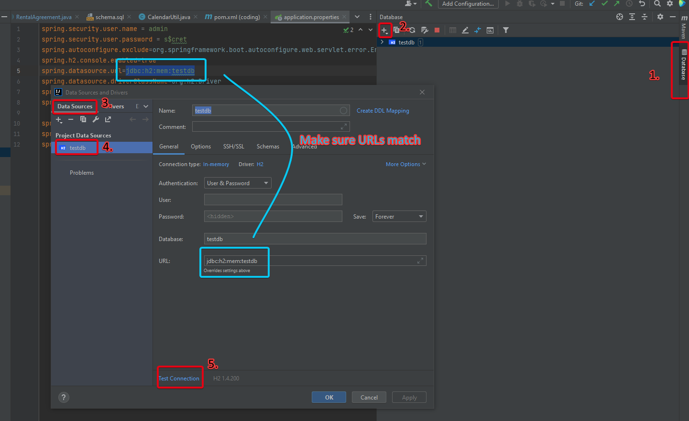

# RT0222

## Tests

Please
see [CheckoutServiceTests.java](https://github.com/ProductOfAmerica/rt0222/blob/master/src/test/java/com/rt0222/service/CheckoutServiceTests.java)
for the proof scenarios.

## Print method

Because the "Rental Agreement should include a method that can print the above values as text to the console," I have
included a .toString() override inside
of [RentalAgreement.java](https://github.com/ProductOfAmerica/rt0222/blob/master/src/main/java/com/rt0222/domain/model/RentalAgreement.java)
. This may be called to return a formatted string of the Rental Agreement object.

## GitHub Actions

I've gotten some quick GitHub actions set up. Tests are run automatically on every push to the master branch.

## Installation

### How to setup H2 Connection for Intellij

1. Click on `Database` tab, right side of screen.
2. Click `New` button.
3. Click `Add` then select H2.
4. H2 Datasource is added.
    1. Copy `sping.datasource.url`
       from [application.properties](https://github.com/ProductOfAmerica/rt0222/blob/master/src/main/resources/application.properties)
       and put it into the `URL` section of the data sources widow.
5. Click `Test Connection` to test the connection.
6. Find `data.sql` and `schema.sql` files under the `resources` folder. Execute both files to load data (ensuring load,
   failsafe for Spring).

